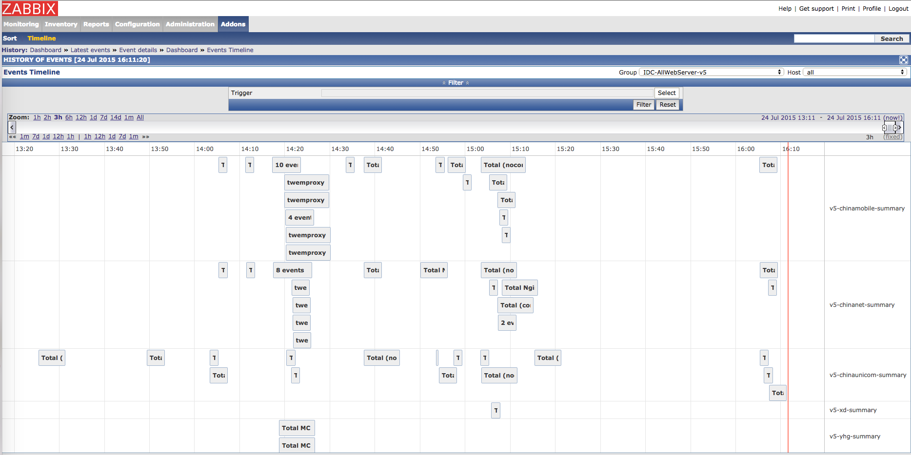

# Zabbix Web Timeline Plugin

timeline 插件是作为对 zabbix-web 的 event 页的扩展补充。

对于 zabbix 监控事件，一般可以在主页的 **Last 100 issues** 区域查看最近内容，或者点击 **Monitoring** 菜单的 **Events** 页查看更多历史事件。但是这两处都是表格方式展现，注重于事件当前状态，对概况回溯并不方便。

使用 timeline 插件，以时间轴为核心，快速对比不同报警事件在时间轴上的延续时长，发生的先后等，对故障排查会有一些额外的帮助。

## 使用方式

复制 `include`, `js`, `styles`, `images` 目录，及 `timeline.php` 文件，到你的 zabbix-web 发布目录即可。

## 友情提示

代码仅在 zabbix-web-2.2.5 上测试运行通过。不保证其他版本一定正常。

## 相关

Timeline.js: <http://almende.github.io/chap-links-library/timeline.html>
